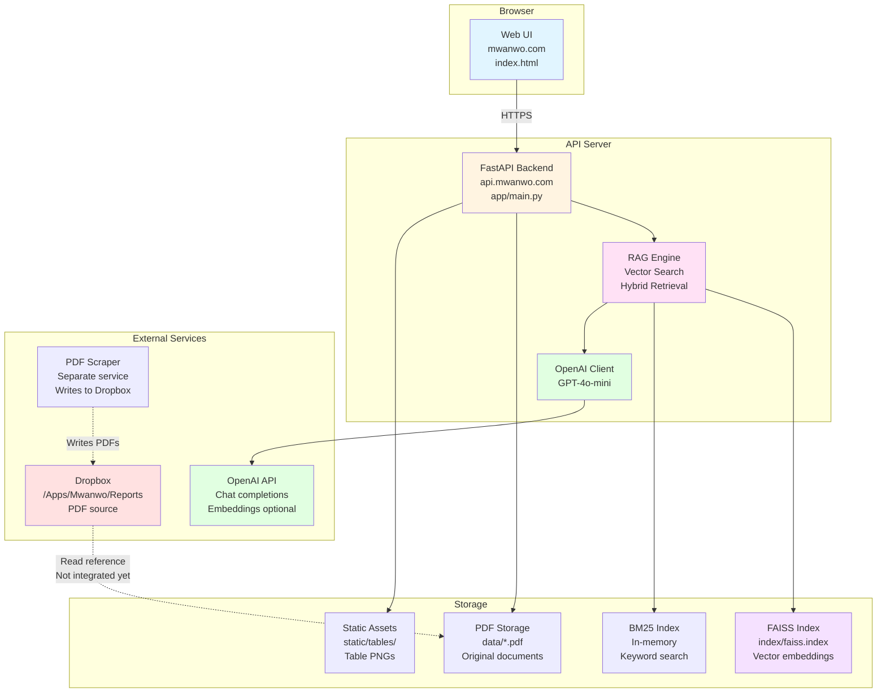

# Architecture

System architecture and component overview.

---

## System Diagram

---

## Component Descriptions

### Web UI (`web/index.html`)
- **Purpose**: User-facing chatbot interface
- **Technology**: Vanilla HTML/CSS/JavaScript (no framework)
- **Features**: Drag-and-drop uploads, streaming responses, PDF viewer, citation links
- **Communication**: REST API calls to backend

### FastAPI Backend (`app/main.py`)
- **Purpose**: API server handling requests, routing, and orchestration
- **Endpoints**: `/chat`, `/upload`, `/files`, `/health`, etc.
- **Middleware**: CORS, static file serving
- **Responsibilities**: Request validation, response formatting, error handling

### RAG Engine (`app/rag.py`)
- **Purpose**: Retrieval-Augmented Generation core logic
- **Components**:
  - **VectorStore**: FAISS index management, embedding generation
  - **Hybrid Search**: Combines FAISS (semantic) + BM25 (keyword)
  - **Query Expansion**: HyDE (Hypothetical Document Embeddings)
  - **Reranking**: Cross-encoder + weighted features
- **Features**: Dual-tier chunking (big/small), table detection, scope filtering

### Vector Store (`VectorStore` class)
- **Purpose**: Manages document embeddings and similarity search
- **Storage**: FAISS index files (`faiss.index`, `meta.npy`, `texts.npy`)
- **Embedding model**: sentence-transformers/all-MiniLM-L6-v2 (384-dim)
- **Operations**: Add chunks, search, remove documents

### LLM Client (`OpenAI`)
- **Purpose**: Generate answers from retrieved context
- **Model**: gpt-4o-mini (configurable via `MODEL` env var)
- **Usage**: Chat completions, HyDE query expansion
- **Streaming**: Supported via `/chat/stream` endpoint

### PDF Processing
- **Extraction**: PyMuPDF (fitz) for text extraction
- **Tables**: pdfplumber for table detection
- **Optional OCR**: pytesseract (when `OCR_ENABLED=true`)
- **Storage**: Original PDFs saved to `data/` directory

### Index Storage
- **FAISS index**: Vector embeddings (`index/faiss.index`)
- **Metadata**: Document/page mappings (`index/meta.npy`)
- **Texts**: Chunk text storage (`index/texts.npy`)
- **BM25**: Built from texts in memory (no persistent storage)

### External Dependencies
- **OpenAI API**: LLM inference and optional embeddings
- **Dropbox**: PDF source (via separate scraper service)
  - **Note**: Dropbox integration not yet implemented in this codebase
  - **Assumption**: Scraper writes PDFs to Dropbox; manual sync or future integration will read from there

---

## Data Flow

### Upload Flow
1. User uploads PDF via UI
2. `POST /upload` receives file
3. PDF saved to `data/` directory
4. Text extracted page-by-page
5. Pages chunked (big: 1600 chars, small: 600 chars)
6. Chunks embedded (sentence-transformers)
7. Chunks added to FAISS index + BM25 index
8. Table detection runs; table text indexed separately
9. Response: `{"ok": true, "chunks_added": N}`

### Query Flow
1. User asks question via UI
2. `POST /chat/stream` receives query
3. **Query expansion**: HyDE generates 2 expanded queries
4. **Scope detection**: Extracts company codes/document names from query
5. **Hybrid search**: 
   - FAISS semantic search (vector similarity)
   - BM25 keyword search
   - Fusion with alpha=0.65 (65% semantic, 35% keyword)
6. **Reranking**: Cross-encoder + weighted features (numeric, finance keywords, subjectivity penalty)
7. **Scope filtering**: Removes hits from irrelevant documents (if scope detected)
8. **Context building**: Top-K chunks formatted with citations
9. **LLM generation**: OpenAI GPT-4o-mini generates answer from context
10. **Streaming**: Answer streamed back token-by-token
11. **Citations**: Page-level citations included in response

### Follow-up Flow
- **Context linking**: `RecentContextLinker` analyzes query for follow-up intent
- **History lookup**: Checks last 10 Q&A pairs for context
- **Query enhancement**: Adds company names, years from previous questions
- **Scope inheritance**: Uses document scope from previous question if current query lacks scope

---

## Key Design Decisions

### Hybrid Search
- **Why**: Combines semantic understanding (FAISS) with exact keyword matching (BM25)
- **Trade-off**: More complex than pure vector search, but better recall for finance documents

### Dual-Tier Chunking
- **Why**: Big chunks preserve context; small chunks enable precise matches
- **Trade-off**: Larger index size, but better retrieval for both broad and narrow queries

### Scope Filtering
- **Why**: Prevents cross-company leakage (e.g., DGC info appearing in VGC queries)
- **Implementation**: Pattern matching on company codes in filenames and query text

### Streaming Responses
- **Why**: Better UX (perceived latency lower than waiting for full response)
- **Implementation**: Server-Sent Events (SSE) via FastAPI `StreamingResponse`

### Lazy Table PNGs
- **Why**: Generates table images on-demand instead of pre-processing all tables
- **Trade-off**: Slightly slower first access, but saves storage and processing time

### In-Memory BM25
- **Why**: Simpler than persistent BM25 index; fast enough for current scale
- **Trade-off**: Must rebuild on restart (loads from FAISS texts quickly)

---

## Scalability Considerations

### Current Limitations
- **FAISS IndexFlatIP**: Exact search (O(n) per query) — slow for large indexes
- **Single server**: No horizontal scaling built-in
- **In-memory BM25**: Limited by RAM for very large document sets

### Potential Improvements
- **FAISS HNSW**: Approximate search (O(log n)) — 10-100x faster
- **Persistent BM25**: Store BM25 index to disk for faster restarts
- **Multiple workers**: Gunicorn with 4+ workers handles concurrent requests
- **Caching**: Query result caching for common questions
- **Managed vector DB**: Migrate to Pinecone/Qdrant for horizontal scaling

---

## Security

- **CORS**: Currently open (`allow_origins=["*"]`) — restrict in production
- **File access**: Path traversal protection via `os.path.basename()`
- **API keys**: Stored in environment variables, never in code
- **Rate limiting**: Not implemented — add via middleware or reverse proxy

---

## Dependencies

See [TECH_GUIDE.md](TECH_GUIDE.md) for full dependency list.

Key libraries:
- FastAPI (web framework)
- FAISS (vector search)
- sentence-transformers (embeddings)
- OpenAI (LLM)
- PyMuPDF (PDF processing)

---

*For deployment and operational details, see [TECH_GUIDE.md](TECH_GUIDE.md)*
